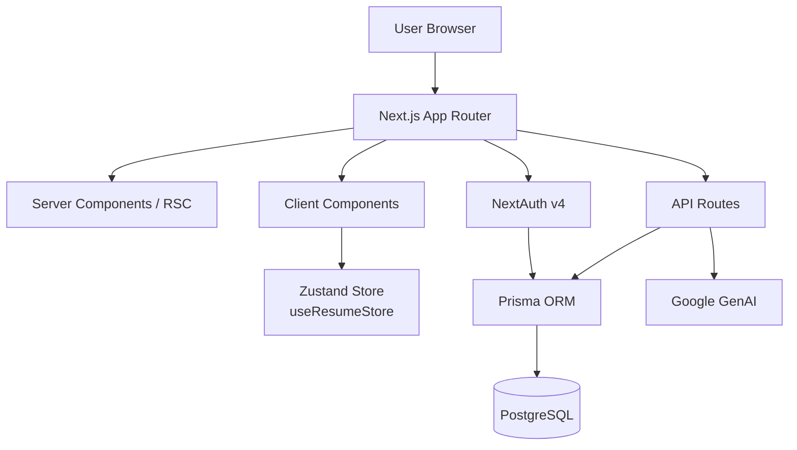

# CV Maker — Project Analysis

## Overview

**Smart Resume Maker** is a full-stack, production-oriented **AI-powered resume builder** built with Next.js 16, targeting the **`smartresumemaker.com`** domain. It is a SaaS-style web app with a free tier and a PRO plan, deployed to Vercel.

---

## Technology Stack

| Layer | Technology |
|---|---|
| Framework | Next.js 16.2.9 (App Router) |
| Language | TypeScript 5 |
| Styling | Tailwind CSS 4 + shadcn/ui |
| Database | PostgreSQL (via Prisma 7) |
| Auth | NextAuth v4 (Credentials + Google OAuth) |
| State | Zustand 5 (with `persist` middleware) |
| AI | Google Generative AI (`@google/genai`) |
| PDF | jsPDF + html2canvas + react-to-print |
| DOCX | `docx` library |
| Animations | Framer Motion 12 |
| Charts | Recharts 3 |
| Forms | React Hook Form + Zod v4 |
| Data Fetching | SWR 2 |
| Analytics | Vercel Analytics + Speed Insights |
| Hosting | Vercel (implied by config + deps) |

---

## Architecture



### Key Directories

```
src/
├── app/
│   ├── page.tsx               ← Landing page (force-static SSG)
│   ├── layout.tsx             ← Root layout (metadata, JSON-LD, analytics)
│   ├── builder/               ← Main resume editor (~36KB page.tsx!)
│   ├── dashboard/             ← Auth-gated user dashboard
│   │   ├── resumes/           ← Resume management
│   │   ├── settings/          ← User settings
│   │   └── templates/         ← Template browser
│   ├── api/
│   │   ├── auth/              ← NextAuth endpoints
│   │   ├── ai/optimize        ← AI resume optimization
│   │   ├── ai/suggestions     ← AI suggestions
│   │   ├── resumes/           ← CRUD for resumes
│   │   ├── upload/            ← PDF/DOCX upload & parse
│   │   ├── contact/           ← Contact form
│   │   └── user/              ← User management
│   ├── blog/                  ← Blog (MDX/static posts)
│   ├── resume-examples/       ← SEO landing pages
│   ├── templates/             ← Template gallery
│   ├── ats-resume-builder/    ← SEO landing page
│   ├── free-resume-builder/   ← SEO landing page
│   └── r/                    ← Public resume share links
├── components/
│   ├── builder/               ← Resume editor components (12 files + 17 templates)
│   ├── layout/                ← Navbar, Footer, etc.
│   ├── home/                  ← Landing page sections
│   └── ui/                   ← shadcn/ui primitives
├── store/
│   └── useResumeStore.ts      ← Zustand global state
├── lib/
│   ├── auth.ts                ← NextAuth config
│   ├── prisma.ts              ← Prisma client singleton
│   ├── atsScoring.ts          ← ATS keyword scoring logic
│   ├── exportDocx.ts          ← DOCX export helper
│   └── posts/                 ← Blog post data
└── server/                    ← (empty — future server actions)
```

---

## Database Schema (Prisma / PostgreSQL)

| Model | Key Fields |
|---|---|
| `User` | id, name, email, passwordHash, role (USER/ADMIN), plan (FREE/PRO) |
| `Resume` | id, userId, title, templateId, personalInfo, summary, experience, education, skills, projects, certifications, languages, customSections, atsScore |
| `JobAnalysis` | id, userId, resumeId, jobDescription, matchedKeywords, missingKeywords, matchScore, suggestions |
| `Account` | OAuth account linking |
| `Session` | JWT sessions |
| `VerificationToken` | Email verification |

Resume content fields (experience, education, skills, etc.) are stored as **JSON blobs**, which offers flexibility but sacrifices queryability.

---

## Core Features

- ✅ **Multi-step resume builder** — PersonalInfo → Experience → Education → Skills → Optional → Finalize
- ✅ **17 resume templates** — ATS-Classic, Developer, Executive, Creative, Academic, Two-Column, etc.
- ✅ **ATS Scoring** — keyword-extraction based scoring against job descriptions
- ✅ **AI Optimization** — Google GenAI for bullet point suggestions and full resume optimization
- ✅ **PDF export** — jsPDF + html2canvas
- ✅ **DOCX export** — `docx` library
- ✅ **PDF/DOCX upload & parsing** — pdf-parse + pdf2json
- ✅ **Authentication** — Credentials + Google OAuth (NextAuth v4)
- ✅ **Dashboard** — Save/manage multiple resumes (requires login)
- ✅ **Public share links** — `/r/[id]` for shareable resume URLs
- ✅ **Blog** — Static MDX-based content
- ✅ **SEO-heavy landing pages** — resume examples, ATS builder, free builder
- ✅ **Accent color picker** — per-template color customization
- ✅ **Auto-save** — Zustand `persist` to localStorage
- ✅ **Cookie consent banner**
- ✅ **Admin panel** — Role-based access (`ADMIN` role)

---

## Performance Optimisations Noted

- Landing page is **force-static** (SSG)
- Below-the-fold sections are **dynamically imported** (`next/dynamic`)
- Blur mesh decorations are **desktop-only** (`hidden md:block`)
- No animation classes on the LCP element (`<h1>`)
- AVIF/WebP image formats configured
- `lucide-react` tree-shaken via `optimizePackageImports`
- Bundle analyzer available (`ANALYZE=true`)
- Vercel Speed Insights + Analytics integrated

---

## Potential Issues & Observations

### 🔴 Critical

| Issue | Location | Detail |
|---|---|---|
| **Hardcoded test credentials in production code** | [`auth.ts` L44-46](file:///c:/Users/anime/Desktop/CV%20Maker/src/lib/auth.ts#L44-L46) | `test@example.com` / `password` will always authenticate — a major security hole |
| **`datasource db` missing `url`** | [`schema.prisma` L6-8](file:///c:/Users/anime/Desktop/CV%20Maker/prisma/schema.prisma#L6-L8) | No `url = env("DATABASE_URL")` line in the datasource block — Prisma will fail without it unless it's resolved elsewhere |

### 🟡 Warnings

| Issue | Location | Detail |
|---|---|---|
| **`@ts-ignore` in store** | [`useResumeStore.ts` L300, L315](file:///c:/Users/anime/Desktop/CV Maker/src/store/useResumeStore.ts#L300-L301) | Type-unsafe generic optional section updaters; should use typed overloads |
| **Builder page is ~36KB** | [`builder/page.tsx`](file:///c:/Users/anime/Desktop/CV Maker/src/app/builder/page.tsx) | Extremely large single file — likely a bundling/splitting concern |
| **Legacy `root.projects` field** | [`useResumeStore.ts`](file:///c:/Users/anime/Desktop/CV%20Maker/src/store/useResumeStore.ts#L118-L119) | Kept for backward compat but adds maintenance burden |
| **`allowDangerousEmailAccountLinking: true`** | [`auth.ts` L30](file:///c:/Users/anime/Desktop/CV%20Maker/src/lib/auth.ts#L30) | Allows account takeover if email is not verified — acceptable only if email verification is enforced |
| **`server/` directory is empty** | `src/server/` | Placeholder that was likely intended for server actions |
| **`hooks/` directory is empty** | `src/hooks/` | No custom hooks extracted despite the builder's complexity |

### 🟢 Strengths

- Excellent SEO setup (JSON-LD schema, OpenGraph, Twitter cards, sitemap, robots.ts)
- Thoughtful performance budgeting on the landing page (LCP comments in code)
- Clean Zustand store with migration logic for stored data format changes
- Proper role/plan enums for future monetization
- 17 diverse resume templates — strong product depth
- `pdf-parse` + `pdf2json` dual PDF parsing is robust

---

## Summary

This is a **well-structured, production-level SaaS resume builder** with strong SEO awareness and good frontend architecture. The core resume data model, state management, and template system are all solid. The main areas for attention are:

1. **Remove the hardcoded test credentials** from `auth.ts` before any real users touch this.
2. **Verify the Prisma `datasource url`** is correctly set in env and schema.
3. **Consider splitting `builder/page.tsx`** — at 36KB it's likely doing too much in one file.
4. **Extract shared hooks** — the empty `hooks/` directory suggests this was planned but not done.
